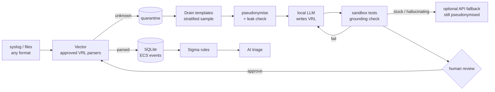

# privasoc

**A privacy-first, local-LLM SOC analyst that writes its own log parsers.**

Point any log source at privasoc. Lines it cannot parse go to a quarantine; a small
local LLM then writes a [VRL](https://vector.dev/docs/reference/vrl/) parser that
normalises them to [ECS](https://www.elastic.co/guide/en/ecs/current/index.html),
tests it in Vector's sandbox, and asks a human to approve it. Nothing leaves your
machine un-pseudonymised: every prompt, local or remote, goes through a
shape-preserving pseudonymisation layer, and leakage is measured, not assumed.

> Status: **steps 1-3 of 8 done** (core, parser generation, evaluation) plus source
> onboarding and host health. See the [roadmap](#roadmap) and every design
> decision, with its rationale, in [docs/DECISIONS.md](docs/DECISIONS.md).

## Why, and what it is not

privasoc does **not** replace Logstash, Vector or vendor integrations: it runs on Vector and
uses existing parsers first. On formats someone already wrote a parser for, that parser wins
(hand-written reference F1 0.87 vs 0.53 for the local model, see below).

The model is the **last resort**, for the long tail no integration covers: in-house
applications, rare devices, formats changed by a firmware update. There, writing and
maintaining a parser costs an engineer hours per format; privasoc drafts one in seconds,
proves it on the real lines, and a human approves it. The quarantine doubles as a drift
detector: a line no parser recognises is kept and flagged, never silently mis-parsed.

- **Verifiable, not trusted**: every proposal compiles in Vector's sandbox, runs on held-out
  lines, and every extracted value must be grounded in the raw line (no invented values in
  90 evaluation runs).
- **Private by construction**: local model by default; pseudonyms keep the *shape* of what
  they replace, so a parser written on pseudonymised samples works on real data; leakage is
  measured, not assumed.

## How a source is onboarded

1. Point the device at privasoc (e.g. Pi-hole: remote syslog to `privasoc:5514`).
2. privasoc sees a **new sender** and lists it as *pending*; its lines are held, not ingested
   and not shown to any model, until a human approves the host (`privasoc hosts approve`).
3. privasoc checks whether the format is **already known**: Vector's built-in parsers
   (Apache/nginx combined and common log, CEF...) and already-approved parsers.
4. **Known**: lines go straight to ECS fields through a fixed, tested mapping. No LLM.
5. **Unknown**: lines stay in quarantine; the local model proposes a parser
   (`privasoc propose`), a human reviews and approves it (`privasoc parsers approve`).
6. On approval the parser is deployed to Vector (hot reload) and the **quarantined backlog is
   re-ingested**, so nothing received before the approval is lost.

Every approved host then has a **health status** (`privasoc hosts list`, `/health/hosts`):
silence longer than its usual rhythm (a silent firewall is a security signal), volume drops
or spikes against its own baseline, parse rate (a drop means the format drifted) and clock
skew, each as `ok` / `warning` / `critical` with the reason.

## Architecture



## Quick start

Requirements: [uv](https://docs.astral.sh/uv/), the [Vector](https://vector.dev/download/)
binary (its VRL runtime is the parser sandbox) and any OpenAI-compatible LLM server,
e.g. [Ollama](https://ollama.com) with `ollama pull qwen3:8b`.

```bash
uv sync
uv run privasoc init            # writes .env with fresh secrets
# edit .env: PRIVASOC_LLM_LOCAL_MODEL=qwen3:8b, PRIVASOC_VECTOR_BIN=/path/to/vector

uv run privasoc import examples/pihole.log --source pihole   # synthetic data; a file import
                                                             # approves its host
uv run privasoc quarantine                                   # unknown lines per source
uv run privasoc propose --source pihole                      # the LLM writes a parser
uv run privasoc parsers show <id>                            # VRL, checks, preview
uv run privasoc parsers approve <id>                         # human decision + backfill
uv run privasoc hosts list                                   # senders, status, health
```

By default the model does not write code: it answers with a small YAML spec (a regex and
an ECS mapping per line shape), which privasoc validates and compiles to VRL itself. Small
local models are far more reliable this way; `--mode vrl` asks for free-form VRL instead.
`propose` prints each attempt (`spec`, `compile`, `runtime`, `schema`, `ungrounded` or `ok`).
When the local model gives up, stagnates or hallucinates, it stops and suggests
`--provider remote`; set `PRIVASOC_AUTO_FALLBACK=true` to escalate automatically. Either way
the remote model only ever sees pseudonymised lines.

Live mode: `docker compose up -d`, then send syslog to UDP/TCP `5514` or drop `*.log`
files in `data/inbox/`; new senders appear in `privasoc hosts list` as pending. Approving a parser regenerates `vector/pipeline.yaml`, which Vector
hot-reloads.

Example (real output):

```text
raw:           time="1727344862" src="192.168.1.10" dst="8.8.8.8" user="jdoe"
pseudonymised: time="1727344862" src="10.134.164.171" dst="198.18.88.159" user="user-05c69e"
```

Private IPs stay private (10/8), public IPs map to the never-routed 198.18.0.0/15,
subnets and domain hierarchies stay consistent, and the mapping is kept in a local,
encrypted vault so answers can be re-identified for display only.

## Evaluation

```bash
uv run privasoc eval fetch                      # Elastic ground truth, 10 formats (not redistributed)
uv run privasoc eval leak                       # pseudonymisation leakage, no LLM needed
uv run privasoc eval run --runs 3 --modes structured,vrl --pseudo on,off
uv run privasoc eval report                     # reports/eval.md + reports/eval.html
```

Each fixture is split in two: the model only ever sees the first half; parsers are scored
field by field on the second half against Elastic's own pipeline output. Full numbers:
[reports/eval.md](reports/eval.md).

Results with `qwen3:8b` (Q4, 8 GB consumer GPU, 3 runs per format):

| | parsers proposed (pass@1 / pass@3) | field F1 when proposed | invented values |
|---|---|---|---|
| free-form VRL | 0 % / 0 % | n/a | n/a |
| **structured spec** (dev, 10 formats) | **70 % / 80 %** | **0.53** | **0** |
| structured, pseudonymisation off | 70 % / 70 % | 0.57 | 0 |
| structured (holdout, 4 unseen formats) | 67 % / 75 % | 0.21 | 0 |
| hand-written reference spec | 100 % | 0.87 | 0 |

What it says: a small local model cannot write code in a niche language, but it can fill a
structured spec that privasoc validates, repairs and compiles; pseudonymisation costs
little quality; and field mapping on unseen formats is where the remaining gap is.
Pseudonymisation leakage went from 26.8 % (first regex detectors) to 8.1 % after the
detectors were improved against these measurements.

## Privacy model

| Guarantee | How |
|---|---|
| No original value in any prompt | Typed detectors + key=value heuristics + propagation; automatic leak check before sending |
| Deterministic, reversible only locally | Keyed HMAC pseudonyms; Fernet-encrypted vault, mode 600, git-ignored |
| No secret or personal log in git | `.gitignore` for `data/` and `.env`; `gitleaks` in pre-commit and CI |
| Remote API is opt-in | Local model by default; API only on explicit action or configured fallback, every call logged |

Known limits are documented rather than hidden: regex detection has residual leakage
on free text; step 5 adds a local-LLM pass and the evaluation publishes the rate.

## Roadmap

1. **Core**: Vector → quarantine → SQLite, regex pseudonymisation, CLI. ✅
2. **Parser generation loop**: sandbox, Drain sampling, anti-hallucination, API fallback. ✅
3. **Parser evaluation** on Elastic integration fixtures + HTML report. ✅
   Source onboarding (pending hosts, known formats first, backfill) and host health. ✅
4. Web review UI (parsers, learned pseudonymisation).
5. Local-LLM pseudonymisation that learns (human-approved).
6. Sigma detection + alerts + structured AI triage.
7. AI-written Sigma rules, natural-language hunting.
8. Triage evaluation; Windows and Proxmox collection.

## Development

```bash
uv sync && uv run pytest -q && uv run ruff check .
pre-commit install
```

MIT licence.
