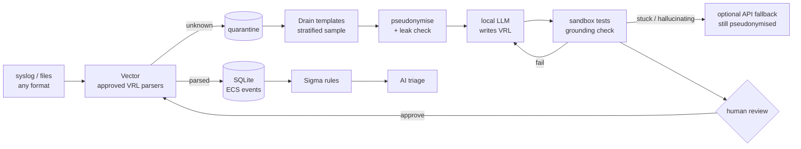

# privasoc

**A privacy-first, local-LLM SOC analyst that writes its own log parsers.**

Point any log source at privasoc. Lines it cannot parse go to a quarantine; a small
local LLM then writes a [VRL](https://vector.dev/docs/reference/vrl/) parser that
normalises them to [ECS](https://www.elastic.co/guide/en/ecs/current/index.html),
tests it in Vector's sandbox, and asks a human to approve it. Nothing leaves your
machine un-pseudonymised: every prompt, local or remote, goes through a
shape-preserving pseudonymisation layer, and leakage is measured, not assumed.

> Status: **step 2 of 8** (parser generation loop). See the [roadmap](#roadmap) and every design
> decision, with its rationale, in [docs/DECISIONS.md](docs/DECISIONS.md).

## Why

- **Unknown formats are the daily pain of detection engineering.** Writing parsers is
  slow; LLMs are good at it but hallucinate. privasoc treats parser generation as a
  task with a *verifiable reward*: the parser compiles or not, extracted fields are
  grounded in the raw line or not, ECS fields match held-out ground truth or not.
- **Security logs are personal data.** Hostnames, users, IPs and paths must not reach
  a third-party model. Pseudonyms keep the *shape* of what they replace, so a parser
  written on pseudonymised samples still works on real data.

## Architecture



## Quick start

Requirements: [uv](https://docs.astral.sh/uv/), the [Vector](https://vector.dev/download/)
binary (its VRL runtime is the parser sandbox) and any OpenAI-compatible LLM server,
e.g. [Ollama](https://ollama.com) with `ollama pull qwen3:8b`.

```bash
uv sync
uv run privasoc init            # writes .env with fresh secrets
# edit .env: PRIVASOC_LLM_LOCAL_MODEL=qwen3:8b, PRIVASOC_VECTOR_BIN=/path/to/vector

uv run privasoc import examples/pihole.log --source pihole   # synthetic sample data
uv run privasoc quarantine                                   # unknown lines per source
uv run privasoc propose --source pihole                      # the LLM writes a parser
uv run privasoc parsers show <id>                            # VRL, checks, preview
uv run privasoc parsers approve <id>                         # human decision
```

By default the model does not write code: it answers with a small YAML spec (a regex and
an ECS mapping per line shape), which privasoc validates and compiles to VRL itself. Small
local models are far more reliable this way; `--mode vrl` asks for free-form VRL instead.
`propose` prints each attempt (`spec`, `compile`, `runtime`, `schema`, `ungrounded` or `ok`).
When the local model gives up, stagnates or hallucinates, it stops and suggests
`--provider remote`; set `PRIVASOC_AUTO_FALLBACK=true` to escalate automatically. Either way
the remote model only ever sees pseudonymised lines.

Live mode: `docker compose up -d`, then send syslog to UDP/TCP `5514` or drop `*.log`
files in `data/inbox/`. Approving a parser regenerates `vector/pipeline.yaml`, which Vector
hot-reloads.

Example (real output):

```text
raw:           time="1727344862" src="192.168.1.10" dst="8.8.8.8" user="jdoe"
pseudonymised: time="1727344862" src="10.134.164.171" dst="198.18.88.159" user="user-05c69e"
```

Private IPs stay private (10/8), public IPs map to the never-routed 198.18.0.0/15,
subnets and domain hierarchies stay consistent, and the mapping is kept in a local,
encrypted vault so answers can be re-identified for display only.

## Privacy model

| Guarantee | How |
|---|---|
| No original value in any prompt | Typed detectors + key=value heuristics + propagation; automatic leak check before sending |
| Deterministic, reversible only locally | Keyed HMAC pseudonyms; Fernet-encrypted vault, mode 600, git-ignored |
| No secret or personal log in git | `.gitignore` for `data/` and `.env`; `gitleaks` in pre-commit and CI |
| Remote API is opt-in | Local model by default; API only on explicit action or configured fallback, every call logged |

Known limits are documented rather than hidden: regex detection has residual leakage
on free text; step 5 adds a local-LLM pass and the evaluation publishes the rate.

## Roadmap

1. **Core**: Vector → quarantine → SQLite, regex pseudonymisation, CLI. ✅
2. **Parser generation loop**: sandbox, Drain sampling, anti-hallucination, API fallback. ✅
3. Parser evaluation on Elastic integration fixtures + HTML report.
4. Web review UI (parsers, learned pseudonymisation).
5. Local-LLM pseudonymisation that learns (human-approved).
6. Sigma detection + alerts + structured AI triage.
7. AI-written Sigma rules, natural-language hunting.
8. Triage evaluation; Windows and Proxmox collection.

## Development

```bash
uv sync && uv run pytest -q && uv run ruff check .
pre-commit install
```

MIT licence.
